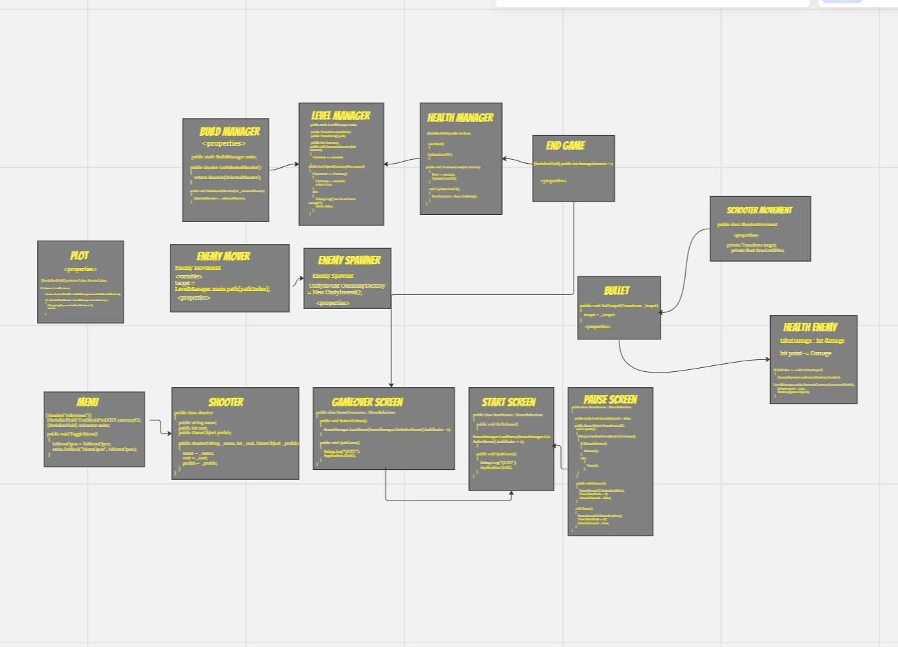
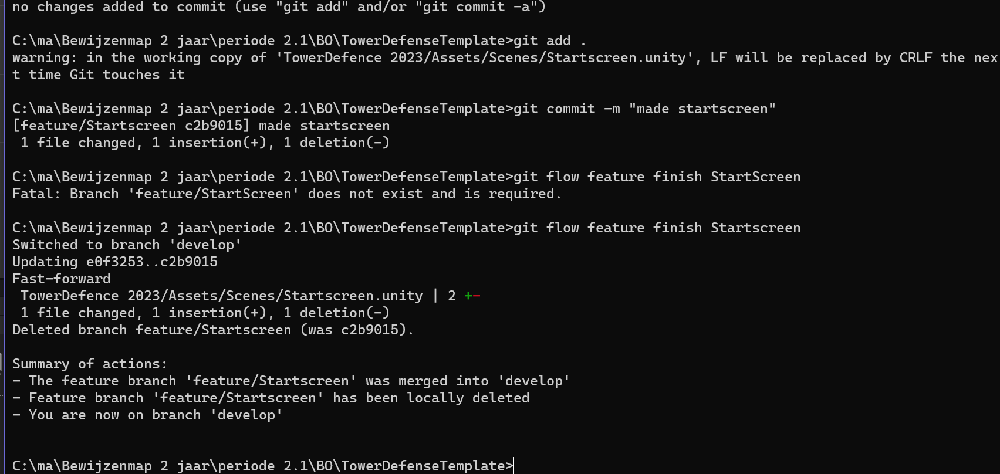

# TowerDefence Game

dit is mijn tower Defense voor de BO van periode 5. In mijn Tower Defense moet je de flower Garden Beschermen tegen Slechte paarse Delete Virusen.
je kan 2 verschillende towers kopen waardoor je ze beter kan beschermen. bij elke Virus die je dood krijg je 25 coins voor terug.
als je helaas je 8 health verliest ben je gedelete door Del de virus. Er zijn 5 waves die je moet halen om te winnen.

## Product 1: "DRY SRP Scripts op GitHub"

*Dit script is DRY omdat je alleen er voor zorgt dat je als je op de plots hovered dat je er Shooters op kan zetten. en ik hoef me zelf er daardoor niet te repeaten.*
[Link naar Script](https://github.com/Delysha/TowerDefenseTemplate/blob/master/TowerDefence%202023/Assets/Code/Scripts/Plots%20%26%20Enemies/Plots/Plot/Plot.cs)

*dit script is SRP omdat het is gemaakt om 1 ding te doen en dat is de enemy te laten bewegen met de waypoints*
[Link naar Script](https://github.com/Delysha/TowerDefenseTemplate/blob/master/TowerDefence%202023/Assets/Code/Scripts/Plots%20%26%20Enemies/Enemy%20Scripts/EnemyMover/EnemyMovement.cs)

## Product 2: "Projectmappen op GitHub"

Dit is de [ROOT](https://github.com/Delysha/TowerDefenseTemplate/tree/master/TowerDefence%202023) folder van mijn unity project.

## Product 3: "Build op Github"

*ik heb mijn build in Github gezet en die is ook daarom nu af.*
dit is de link naar de [Build](https://github.com/Delysha/TowerDefenseTemplate/releases/tag/Release02)

## Product 4: "Game met Sprites(animations) en Textures "

## Product 5: "Issues met debug screenshots op GitHub "

[Hier de link naar mijn issues](https://github.com/Delysha/TowerDefenseTemplate/issues)

## Product 6: "Game design met onderbouwing "

mijn OnePage.

Omschrijf per mechanic welke game design keuzes je hebt gemaakt en waarom je dit hebt gedaan.

* **Je game bevat torens die kunnen mikken en schieten op een bewegend doel.** 
*mijn game heeft turrets waar mee je kan schieten als er een enemy in de buurt is van de Schooter en als de enemy verder loopt gaat de turret naar een andere enemy en zo gaat het door.*
*maar ik heb heb niet maar 1 turret nee ik heb twee verschillende 1 die gewoon op een normalen snelheid schiet en een tweede die achter elkaar blijf schieten waardoor je sneller een enemy killed*

* **Je game bevat vernietigbare vijanden die 1 of meerderen paden kunnen volgen.**  
*mijn game bevat een vernietigbare vijhand die 1 pad volgt door een bloemen tuin met waypoints op verschillende hoeken waardoor die beter op het pad kan lopen.*

* **Je game bevat een “wave” systeem waarmee er onder bepaalde voorwaarden (tijd/vijanden op) nieuwe waves met vijanden het veld in komen.**
*mijn game bevat een wave system die er voor zorgt dat als je alle enemies dood er een nieuwe wave begint na 5 seconde* 
*maar ook als je ze niet allemaal dood komt er alsnog een nieuwe wave na dat alle enemies hun eind doel hebben bereikt of dood zijn na 5 seconde.*

* **Een “health” systeem waarmee je levens kunt verliezen als vijanden hun doel bereiken en zodoende het spel kunt verliezen.** 
*ik heb een Health system met als een enemy zijn doel bereikt er een leven weg gaat en je hebt 5 levens als je dus helemaal dood gaat heb je een death screen om opnieuw te beginnen*

* **Een “resource” systeem waarmee je resources kunt verdienen waarmee je torens kunt kopen en .evt upgraden.**
*ik heb een Resource system waarbij als je een enemy dood je 25 coins krijgt om een nieuwe turret te kopen maar dan moet je wel 100 coins hebben anders kan je het niet halen.*

## Product 7: Class Diagram voor volledige codebase

## Product 8: Prototype test video

Je hebt een werkend prototype gemaakt om een idee te testen. Omschrijf if je readme wat het idee van de mechanics is geweest wat je wilde testen en laat een korte video van de gameplay test zien.
[mijn tower defence game video gespeeld door een vriend](https://youtu.be/CfQasrKZ8MU)

## Product 9: SCRUM planning inschatting 

Je maakt een SCRUM planning en geeft daarbij een inschatting aan elke userstory d.m.v storypoints / zelf te bepalen eenheden. (bijv. Storypoints, Sizes of tijd) aan het begin van een nieuwe sprint update je deze inschatting per userstory. 

Plaats in de readme een link naar je trello en **zorg ervoor dat je deze openbaar maakt**

[Link naar de openbare trello](https://trello.com/b/edgaa7aC/tower-defence-dely)

## Product 10: Gitflow conventions

